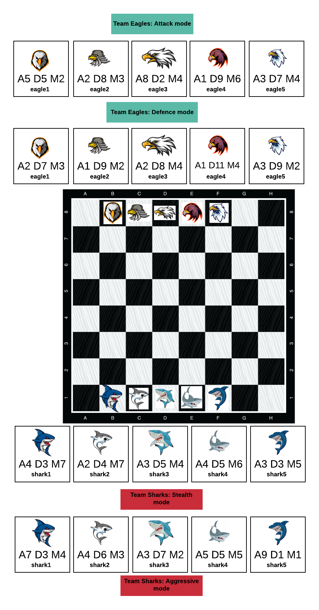

# Eagles vs Sharks -  board game (Object Oriented Software Design) 

# The board Game:

The task is to develop a two dimensional, turn based board game, which is to be based on the classic “board game” design where a two-dimensional board is composed of a number of smaller play segments (such as squares on a chess board or real estate properties on a monopoly board) and is presented in a graphical representation which will be a topographical (top down) view. 

# Story : 

The Eagle's are a team of space marines who keep the balance in space check. Recently however they have come across the deadliest enemies ever The Sharks. They are space beasts that go from planet to planet trying to destroy everything they cross paths with. It's up to the Eagle team to try and stop them, but will the Sharks prevail? Only time will tell.

# Game Rules and information:

- The game is played on a 8 x 8 = 64 cell based platform. 

- Each character/piece has their own move power and attack power

- The move power dictates how many cells you are able to move a piece upto the move power or below it.

- While the attack power dictates how much strength the character has to knock the other opponents out of the game.

-  The pieces can move forwards, backwards, left, right and diagonally but.

- Pieces can move wherever the player wants based on the move power limit and start attacking if they are next to cell of a particular piece.

-  The gameplay works based on the basis of attack and defence power, if a piece attacks another piece with a greater defence power then the attack power of the piece that attacked it, the defence of the piece that was attacked will be subtracted from the attack power of the piece that attacked it or else if the defence power was lower than the attack power then the piece with the lower defence power is autmatically out of the game.

- Pieces with lower attack powers cannot go in the paths where pieces with higher powers are present as they would get knocked out pf the game

- If a piece with a higher power comes in contact with two pieces who sum of attack power is higher than the other piece then they knocked out of the game

- Finally if a piece with a greater attack power is left in one team and the other team just has a piece with a lower defence power, then the team with the piece with the higher attack power wins automatically(TBD) 

- Eagles always play first

# GRASP principles
### Low coupling
### High cohesion
### Creator
### Controller
The system is based on MVC design and structures, therefore it has controllers

### Polymorphism
### Indirection

# SOLID principles

### Single Responsibility Principle
### Open/Close Principle
### Liskov Substitution Principle
### Interface segregation principle
### Dependency Inversion Principle
### The Don’t Repeat Yourself Principle

  

